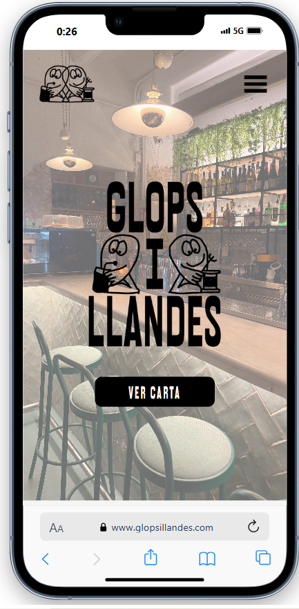
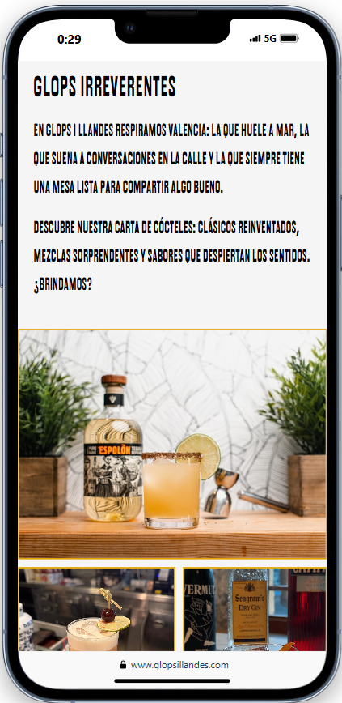
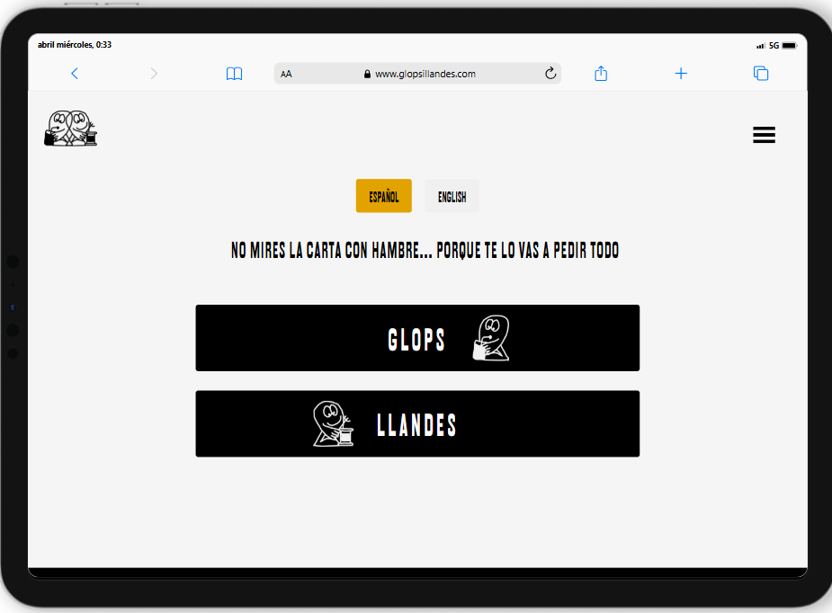
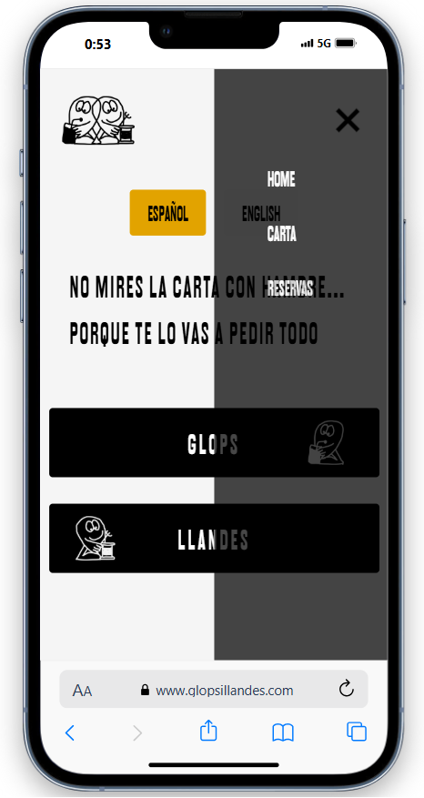
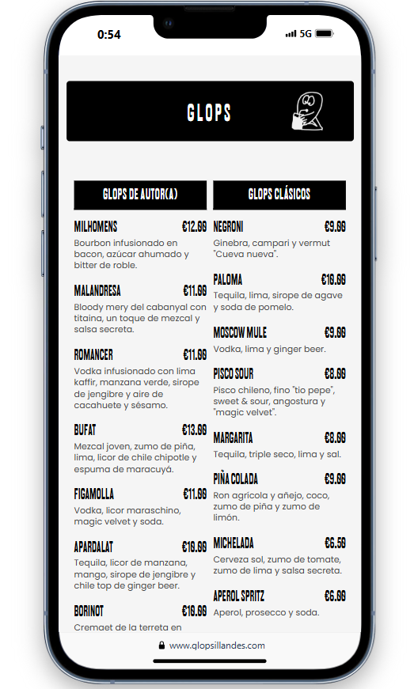
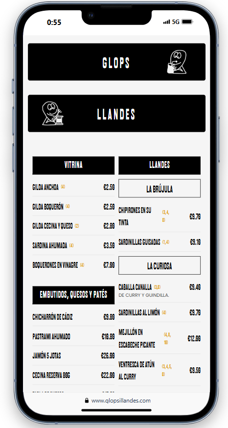
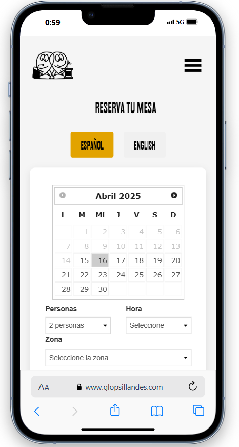
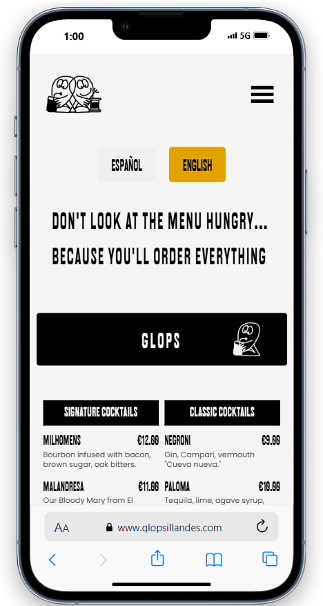

# 🍹 GLOPS I LLANDES 🥫

<div align="center">
  
</div>

## Descripción 📋

El proyecto consiste en un sitio web completo para "Glops i Llandes", un bar de tapas y cócteles ubicado en el corazón del Cabanyal, Valencia. El desarrollo se ha enfocado siguiendo la metodología mobile-first, garantizando una experiencia óptima en dispositivos móviles sin sacrificar la estética y funcionalidad en pantallas más grandes.

El sitio presenta un diseño atractivo que refleja la personalidad del local, con una navegación intuitiva y secciones bien organizadas que permiten a los usuarios conocer la oferta gastronómica, realizar reservas, localizar el establecimiento y sus redes sociales.

## Objetivos 🎯

* Crear una imagen digital atractiva y coherente con la identidad del bar
* Implementar un diseño responsive adaptable a todos los dispositivos
* Ofrecer una navegación intuitiva mediante menú hamburguesa en móviles
* Presentar la carta de forma clara, organizada y accesible
* Integrar un sistema de reservas funcional
* Facilitar la localización del local mediante mapa interactivo
* Implementar un sistema de cambio de idioma (español/inglés)
* Optimizar la carga y rendimiento del sitio

## Vistas del sitio web 🔍

### Página de inicio (versión móvil) 📱
<div align="center" style="display: flex; justify-content: center; gap: 10px;">
  
  
</div>

### Página de inicio (versión tablet) 📱
<div align="center">
  
</div>

### Página de inicio (versión desktop) 💻
<div align="center">
  
</div>

### Navegación con menú hamburguesa 🍔
<div align="center">
  
</div>

### Carta de productos 🍴🍸
<div align="center" style="display: flex; justify-content: center; gap: 10px;">
  
  
</div>

### Sistema de reservas 📅
<div align="center">
  
</div>

### Cambio de idioma 🌐
<div align="center">
  
</div>

## Tecnologías utilizadas 🛠️

* **HTML5** - Estructura semántica y accesible
* **CSS3** - Diseño responsive con flexbox y grid
* **JavaScript** - Funcionalidades interactivas y validaciones
* **Google Maps API** - Integración de mapa interactivo
* **Cover Manager** - Integración del formulario de reservas

## Despliegue del sitio 🚀

El sitio web ha sido desplegado utilizando **Vercel**, lo que permite una distribución rápida y eficiente, a la vez que facilita futuras actualizaciones. El proceso de despliegue incluyó:

1. Optimización de todos los recursos (imágenes, CSS, JavaScript)
2. Validación de enlaces y funcionalidades cruzadas
3. Pruebas en múltiples navegadores y dispositivos
4. Configuración del dominio personalizado

El sitio está disponible en la siguiente URL:
[https://www.glopsillandes/index.html](https://www.glopsillandes.com/index.html)

## Características destacadas ✨

* **Diseño Mobile-First**: Optimizado para dispositivos móviles y escalable a pantallas más grandes
* **Navegación intuitiva**: Menú hamburguesa para dispositivos móviles y navegación expandida para desktop
* **Carrusel de imágenes**: Presentación visual atractiva de los platos y bebidas
* **Acordeones interactivos**: Para mostrar las diferentes secciones de la carta
* **Sistema bilingüe**: Soporte completo para español e inglés
* **Formulario de reservas**: Integrado con CoverManager para gestión de reservas
* **Animaciones suaves**: Mejoran la experiencia de usuario y guían la navegación
* **Optimización de imágenes**: Para garantizar tiempos de carga rápidos
* **Código modular**: Estructurado para facilitar mantenimiento y actualizaciones

## Estructura del proyecto 📁

```
glops-i-llandes/
├── CSS/
│   └── style.css          # Estilos principales del sitio
├── JS/
│   └── scripts.js         # Funcionalidades JavaScript
├── fonts/                 # Tipografías personalizadas
│   └── ...
├── img/                   # Imágenes e iconos
│   ├── favicon/           # Favicons para diferentes dispositivos
│   └── ...
├── index.html             # Página principal
├── carta.html             # Página de carta/menú
├── reservas.html          # Sistema de reservas
└── README.md              # Documentación del proyecto
```

## Características responsivas 📱 → 💻

El diseño se adapta fluidamente a diferentes tamaños de pantalla:

* **Móvil (≤ 767px)**: 
  - Menú hamburguesa
  - Diseño en columna única
  - Carrusel optimizado para pantalla pequeña

* **Tablet (768px - 1023px)**:
  - Navegación mejorada
  - Distribución en 2 columnas para la carta
  - Elementos redimensionados para aprovechar espacio

* **Desktop (≥ 1024px)**:
  - Navegación completa
  - Diseño de múltiples columnas
  - Carrusel amplio con controles intuitivos
  - Visualización mejorada de la carta

## Instalación y uso local ⚙️

1. **Clona el repositorio 🔧**
```bash
git clone https://github.com/tu-usuario/glops-i-llandes.git
```

2. **Navega al directorio del proyecto 📂**
```bash
cd glops-i-llandes
```

3. **Abre el proyecto con Live Server o similar 🚀**
Si usas Visual Studio Code, puedes instalar la extensión Live Server y luego hacer clic en "Go Live" desde la barra de estado.

## Mejoras planificadas 🚀

* **Implementar animaciones avanzadas**: Para enriquecer la experiencia visual
* **Optimización de rendimiento**: Mejorar tiempos de carga con técnicas avanzadas
* **Transiciones entre páginas**: Para una navegación más fluida
* **PWA**: Convertir en aplicación web progresiva para funcionamiento offline
* **Accesibilidad avanzada**: Implementar ARIA para mejorar la experiencia de usuarios con discapacidades
* **Galería expandida**: Con lightbox para visualizar fotos en detalle
* **Calendario de eventos**: Para mostrar actuaciones y eventos especiales
* **Formulario de contacto**: Para consultas directas

## Rendimiento y optimización 📊

* **Tiempo de carga**: Optimizado por debajo de 2 segundos
* **Imágenes**: Comprimidas y optimizadas para web
* **CSS**: Estructurado para minimizar repintados
* **JavaScript**: Modular y eficiente para interacciones fluidas
* **Accesibilidad**: Implementación de atributos ARIA básicos
* **SEO**: Metadatos optimizados para motores de búsqueda

## Autor 🧑‍💻

* **Gonzalo Martí** - [Enlace a LinkedIn](https://www.linkedin.com/in/gonzalo-marti-peirats/)

## Agradecimientos 🙏

* A todo el equipo de Glops i Llandes por su colaboración
* Imágenes de productos originales del establecimiento

---

&copy; 2025 Glops i Llandes - Todos los derechos reservados